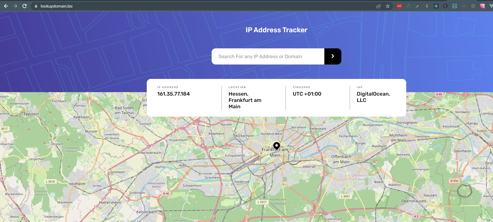
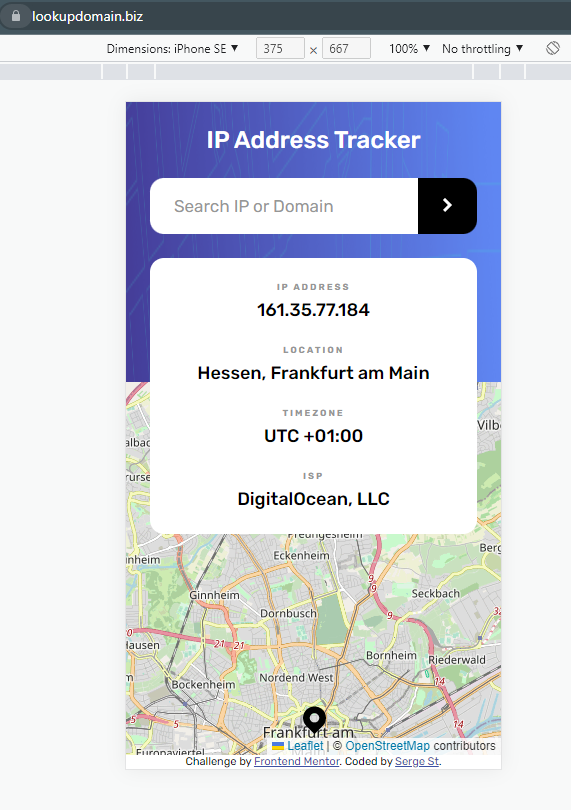

# Frontend Mentor - IP address tracker solution

This is a solution to the [IP address tracker challenge on Frontend Mentor](https://lookupdomain.biz). Frontend Mentor challenges help you improve your coding skills by building realistic projects.

## Table of contents

- [Overview](#overview)
  - [The challenge](#the-challenge)
  - [Screenshot](#screenshot)
  - [Links](#links)
- [My process](#my-process)
  - [Built with](#built-with)
  - [What I learned](#what-i-learned)
  - [Continued development](#continued-development)
  - [Useful resources](#useful-resources)
- [Author](#author)
- [Acknowledgments](#acknowledgments)

## Overview

### The challenge

Users should be able to:

- View the optimal layout for each page depending on their device's screen size
- See hover states for all interactive elements on the page
- See their own IP address on the map on the initial page load
- Search for any IP addresses or domains and see the key information and location

### Screenshot

### Links

- Solution URL: [Add solution URL here](https://github.com/serge-st/ip-address-tracker)
- Live Site URL: [Add live site URL here](https://lookupdomain.biz)

## My process

I wanted to test my skills with React and state management.

At first, I started by building the form and making sure I'm creating the correct requests.

I structured the HTML elements with the mobile-first approach and decided to stretch them to fit the desktop later.

I was a bit uncomfortable with leaving my API key on the front-end, so I built a super simple [backend server](https://github.com/serge-st/ip-address-tracker-server).

When the form was completed I started to work on the map implementation. It was a bit tedious, cause I didn't find the react-leaflet documentation quite friendly.

After the implementation was completed I started to work on styles.

I wanted to practice the deployment process for real-world apps too, so I decided to purchase a cheap domain, a droplet on Digital Ocean and host it there.

I struggled a bit with NGINX configuration, but it worked out in the end. Now the app is hosted online, with a real domain, firewall and SSL protection.

### Built with

- Flexbox
- Mobile-first workflow
- [React](https://reactjs.org/) - JS library
- TypeScript
- MobX
- Axios
- Hosted on Digital Ocean droplet with NGINX
